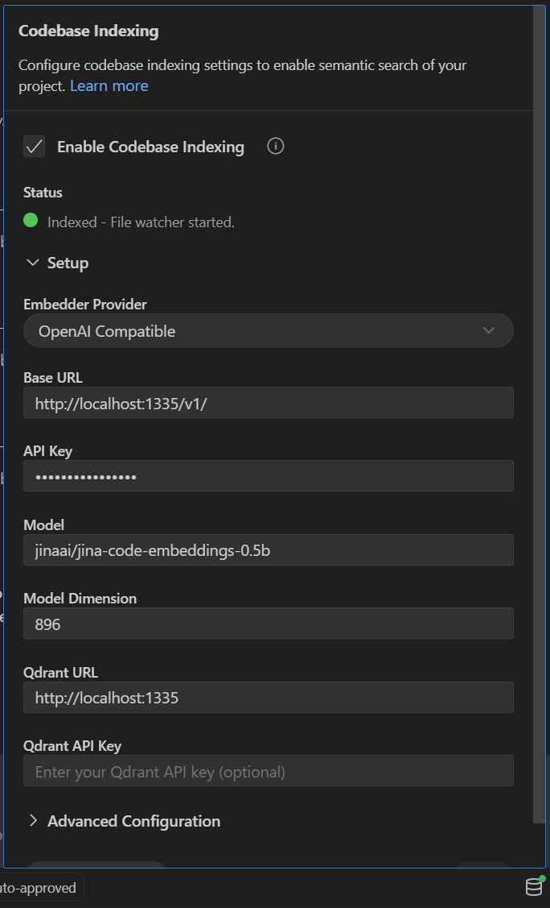

# Local Embeddings For Roo Code

Local codebase indexing and retrieval for [Roo Code](https://github.com/RooCodeInc/Roo-Code). This is likely compatible with Cursor, WindSurf, etc.



Use `PASSWORD` (or any other value) for `API Key`.

# Requirements

- Unix-like environment
- Blackwell GPU
  - The consumer versions are RTX 50 series.
  - The workstation version is [RTX PRO 6000](https://www.nvidia.com/en-us/products/workstations/professional-desktop-gpus/rtx-pro-6000/).

# Build Containers

This is a version of HuggingFace's [text-embeddings-interface](https://github.com/huggingface/text-embeddings-inference) with [CUDA 13.1 support and performance enhancements](https://github.com/huggingface/candle-extensions/compare/main...NotYevvie:candle-ext-cu-13010:main).

### Dependencies

I've upgraded the following libraries to support SM120 (blackwell) and CUDA 13.1:

- `huggingface/candle` [Source Repository](https://github.com/huggingface/candle) | [Upgraded Link](https://github.com/NotYevvie/candle-cu-13010)
- `huggingface/candle-extensions` [Source Repository](https://github.com/huggingface/candle-extensions) | [Upgraded Link](https://github.com/NotYevvie/candle-ext-cu-13010)
- `huggingface/candle-index-select-cu` [Source Repository](https://github.com/michaelfeil/candle-index-select-cu) | [Upgraded Link](https://github.com/NotYevvie/candle-select-cu-13010)

```bash
DOCKER_BUILDKIT=1 docker build --progress=plain -f Dockerfile.embedding -t yevai/fc-embedding:sm120-cu131 .
```

# Prepare Models

```bash
# Download the 1.0GB embedding model
hf download jinaai/jina-code-embeddings-0.5b

# Download the 1.2GB reranker model
hf download jinaai/jina-reranker-v3

# Run setup. This is meant to be an easy one-click-all.
chmod +x inject_tokenizer.sh
./inject_tokenizer.sh
```


## What's included

